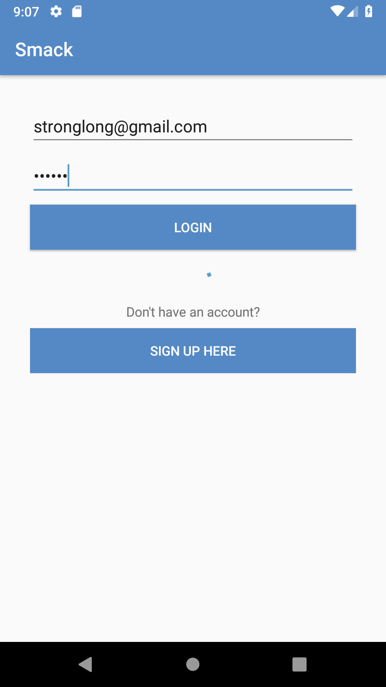

# Chit Chat

Android chat application built with Kotlin and backed by NodeJS and SocketIO that provides basic functions form a chat, such as realtime messaging.

---

## What our application looks like ?

    
  
  
  

---
## Built with
- Kotlin
- Volley
---
### Development
Want to contribute? Great!

To fix a bug or enhance an existing module, follow these steps:

- Fork the repo
- Create a new branch (`git checkout -b improve-feature`)
- Make the appropriate changes in the files
- Add changes to reflect the changes made
- Commit your changes (`git commit -am 'Improve feature'`)
- Push to the branch (`git push origin improve-feature`)
- Create a Pull Request

---

### Bug / Feature Request

If you find a bug, kindly open an issue [here](https://github.com/truongnmt/chit-chat/issues/new).

If you'd like to request a new function, feel free to do so by opening an issue [here](https://github.com/truongnmt/chit-chat/issues/new).
